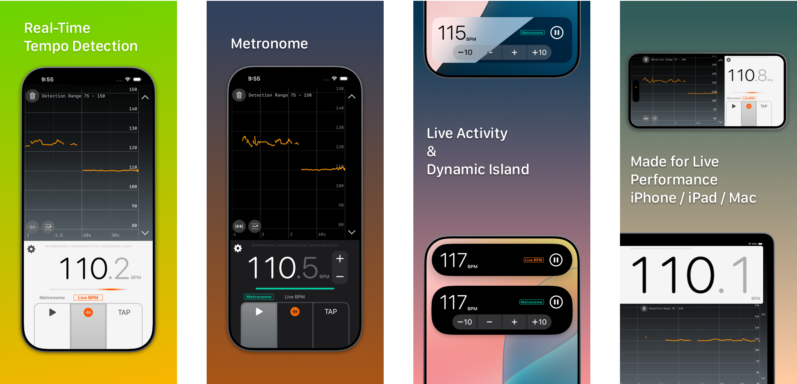

# MetroBPM

Need a tempo tune-up for your live performance? Need to play for dance and keep the speed steady? Curious about the tempo of the music you are hearing? MetroBPM combines a Live Tempo Detector with a Metronome in your pocket. It uses your device's microphone to detect tempo from rhythmic music in Real-Time. Designed for learners, enthusiasts, professionals and performers.

**Features**
- Real-time detection of tempo from rhythmic music
- Tempo history plot for analysis and review
- Metronome with selectable sounds and visualization
- Tap-to-detect tempo

**Modern Design**
- Optimized for live onstage use on iPhone and iPad
- Dark mode for low-power usage on OLED devices

**Note:**
Tempo detection is currently optimized for music with strong rhythmic or percussive elements in quadruple, 6/8 time signatures, performance may vary on other inputs. Currently using [TempiBeatDetection](https://github.com/CheckThisCodeCarefully/TempiBeatDetection) by John Scalo. I plan to improve the algorithm, collaborators welcome.

### Support
Feedback is welcome through [email](mailto:bloomvinelabs@gmail.com). As I'm the sole developer, I will try to read all feedback but cannot respond to all.

### Privacy Policy
MetroBPM uses microphone on your devices only for tempo detection, it does not record any audio. It does not collect any data from you. Any setting and configuration are saved to your devices only.
