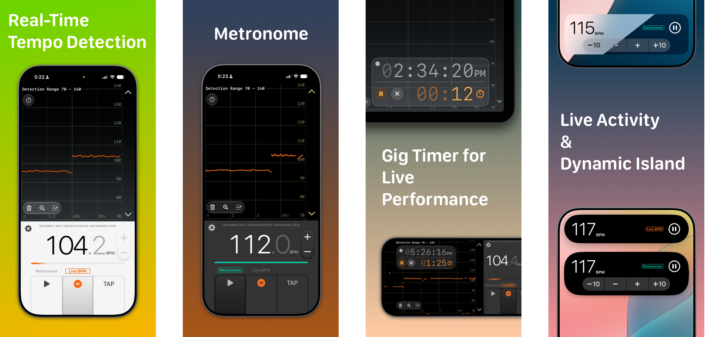

# MetroBPM

Need a tempo tune-up for your live performance? Need to play for dance and keep the speed steady? MetroBPM combines a Live Tempo Detector with a Metronome in your pocket. Designed for iPhone, iPad and Mac, it uses your device's microphone to detect tempo from rhythmic music in Real-Time. MetroPBM is a tool for music learners, professionals and performers.

**Features**
- Real-time detection of tempo from rhythmic music
- Tempo history plot
- Tap-to-detect tempo
- Metronome with visualization and selectable sounds
- Performance / practice timer built-in
- Quickly launch frequently used tempo by tap-hold app icon on homescreen
- No Ads or Subscription

**Modern Design**
- Optimized for live on-stage use on iPhone and iPad
- Dark mode for low-power use on devices with OLED displays, perfect for live stage usage
- Live Activity & Dynamic Island support (monitor and control from Home Screen, Lock Screen and Apple Watch)

**Note:**
Tempo detection is currently optimized for music with strong rhythmic / percussive elements in quadruple, 6/8 time signatures, performance may vary on other inputs. Works best with live music and low background noise. Detection algorithm is based on [Beat and Tempo Tracking](github.com/michaelkrzyzaniak/Beat-and-Tempo-Tracking) by Michael Krzyzaniak.

**Coming in future updates**
- target tempo gauge (set a target tempo and monitor speed up / slow down)

### Support
Feedback is welcome via [email](mailto:bloomvinelabs@gmail.com). As I'm the sole developer, I will try to read all comments but cannot respond to all.

### Privacy Policy
MetroBPM uses microphone on your devices only for tempo detection. It does not record any audio, and it does not collect any data from you. Any setting and configuration are saved to your devices only.

### Version History
*1.1*
- Major revamp of the tempo detection algorithm with improved accuracy and stability
- Improved efficiency should reduce impact on device battery
- NEW: Timer and clock feature for live performances or practice
- Optimized for iOS 26, 27

*1.0.4*
- Metronome and Tempo Detection can now run in the background with Live Activity on Lock Screen
- Dynamic Island and watchOS Smart Stack support
- Refined Zoomed mode to detect smaller tempo range
- Frequently used tempo now saved as home screen app shortcuts
- Additional metronome sounds
  
*1.0.3*
- iOS 18: add detect tempo shortcut to Control Center + Lock Screen
- Tempo graph can now be zoomed dynamically
- Better prompt for device microphone permission

*1.0.2*
- Mac (Catalyst) support
- Improved detection
- Fixed occasional tempo graph glitch
  
*1.0.1*
- iOS 18 support, dark themes
  
*1.0*
- Initial release
